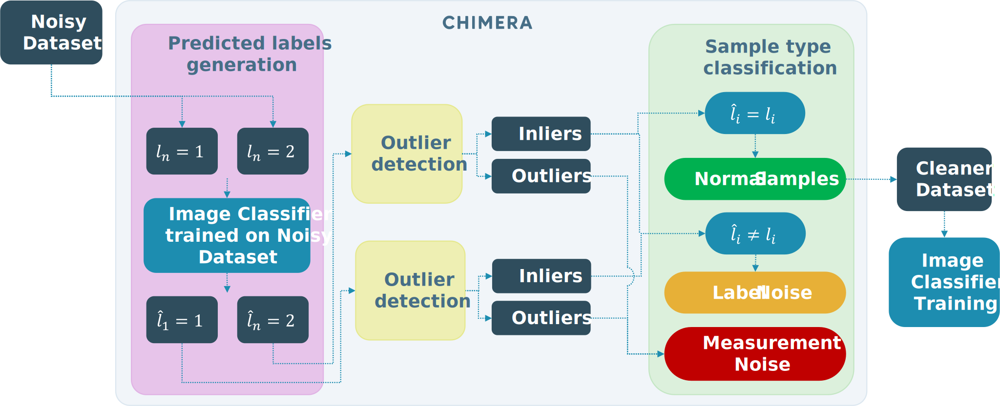

# CHIMERA: A Pipeline for Cleaning Noisy Image Datasets
**Authors:** Laura Martínez Esmeral,  Bart De Ketelaere, Wouter Saeys, Astrid Tempelaere

**Contact:**  
- Code and general questions: via GitHub issues  
- Data access (Insect dataset): wouter.saeys@kuleuven.be
## 📚 Paper 
<table>
  <!-- First row: Paper badge -->
  <tr>
    <td colspan="2" align="left">
      <a href="https://dx.doi.org/10.2139/ssrn.6169047">
        
      </a>
    </td>
  </tr>

  <!-- Second row: Image + CHIMERA text -->
  <tr>
    <td style="width:160px; white-space: nowrap; vertical-align: middle;">
      
    </td>
    <td style="padding-left: 20px; vertical-align: middle;">
  <b>C</b>leaning<br>
      <b>H</b>eterogeneous<br>
      <b>I</b>mage Datasets from<br>
      <b>M</b>easurement and<br>
      Label Nois<b>e</b> for<br>
      <b>R</b>obust Classification<br>
      <b>A</b>ccuracy
    </td>
  </tr>

  <!-- Third row: Citation text -->
  <tr>
    <td colspan="2" align="left">
      To cite this work or read the full details, please see:<br>
      📄 <a href="https://dx.doi.org/10.2139/ssrn.6169047">https://dx.doi.org/10.2139/ssrn.6169047</a>
    </td>
  </tr>
</table>


## 💡 What is CHIMERA?

CHIMERA is a pipeline for cleaning image datasets by separating:
- **Measurement noise** (bad images, artifacts)
- **Label noise** (mislabelled images)

It helps improve dataset quality and model performance with minimal manual effort.

## 🚀 Getting Started
CHIMERA supports multiple dataset workflows. Choose the one that fits your case:

- [Run with FashionMNIST Dataset](#a-fashionmnist-dataset)  
- [Run with Insect Dataset](#b-insect-dataset)  
- [Run with a Custom Dataset](#c-custom-dataset)

> Tip: If you are unsure, start with FashionMNIST as it is the quickest way to test the pipeline.


## 📦 Installation
### 1. Create a conda environment
```
conda create -n chimera python=3.10.8
conda activate chimera
```

### 2. Install Pytorch (with GPU) 
```
conda install pytorch torchvision torchaudio pytorch-cuda=11.7 -c pytorch -c nvidia
```
If this fails, follow the instructions on the official [PyTorch website](https://pytorch.org/get-started/locally/).

### 3. Install additional dependencies
```
pip install -r requirements.txt
```
## 🧠 Overview



## 🧹 Data Cleaning Strategies

The pipeline supports multiple cleaning strategies, including CHIMERA and several baseline or variant methods that can be configured in `config.yaml`.

### Available strategies

- `cnn` (CHIMERA)  
  This is the main method proposed in the paper. It combines CNN-based feature extraction, outlier detection, and label consistency checks to identify measurement and label noise.

- `cnn_corrected_mislabels`  
  Extension of CHIMERA where detected label noise is automatically corrected instead of only being flagged.

- `cnn_no_od`  
  Variant of CHIMERA without the outlier detection step.

- `adbench`  
  Applies anomaly detection using the [ADBench](https://github.com/Minqi824/ADBench) framework.

- `adbench_2d`  
  Applies anomaly detection in a 2D UMAP feature space.

- `adbench_xd_hdbscan`  
  Applies anomaly detection in an x-dimensional UMAP feature space combined with HDBSCAN clustering.


## ⚡ Usage
### A) FashionMNIST Dataset
1. Go inside the `data/` folder and unzip the `fashionmnist.zip` and the `split_60_20_20.zip` files inside it

2. Run the bash script `run_pipeline.sh` from terminal
    ```
    bash run_pipeline.sh
    ```

    Results will be stored in the `logs` folder
### B) Insect Dataset
1. Contact wouter.saeys@kuleuven.be to get access to the `phoneboxdata` and the `split_60_20_20` folders
2. Place both folders inside the `data/` directory
3. Rename `config_phonebox.yaml` to `config.yaml`
4. Run:
    ```
    bash run_pipeline.sh
    ```

### C)  Custom Dataset
1. Organize your dataset:
    ```python
    data/
    your_dataset/
        class_a/
        class_b/
        class_trash/ # this will be your measurement noise
        ...
    ```
2. Modify inside `config.yaml` the `data_params`:
    - `file_extension`
    - `original_data_dir`
    - `data_classes` (the classes of interest)
    - `trash_class` (measurement noise)

3. Run:
    ```
    bash run_pipeline.sh
    ```
### 📊 Visualization (Optional)

To explore UMAP projections interactively:
```
python a05_visualize_umaps_in_app.py
```

## 🔍 Results

CHIMERA was evaluated on our insect dataset. Removing both measurement and label noise from the data improves model performance:

| Dataset | Accuracy (Noisy) | Accuracy (Cleaned) |
|---------|-----------------|------------------|
| Insect  | 87.93%          | 90.52%           |

For more detailed results, see [RESULTS](Results.md).
