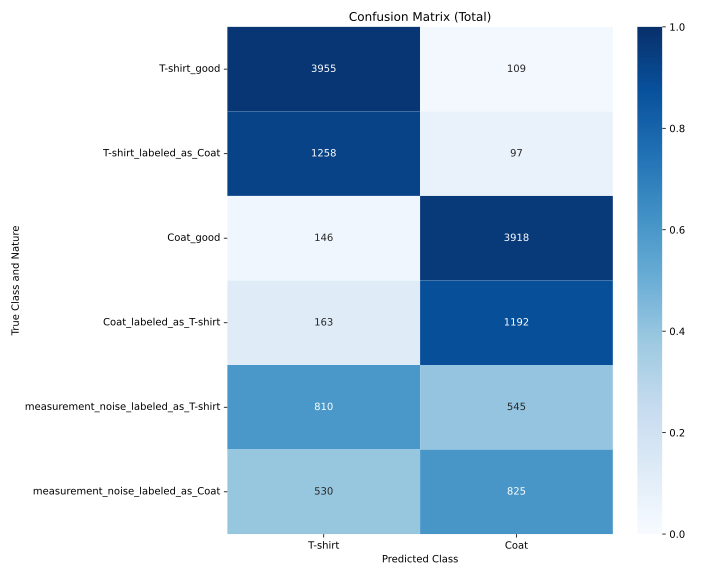
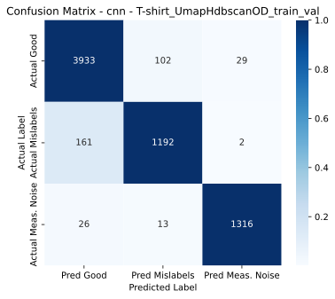
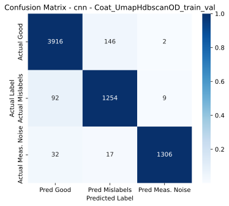
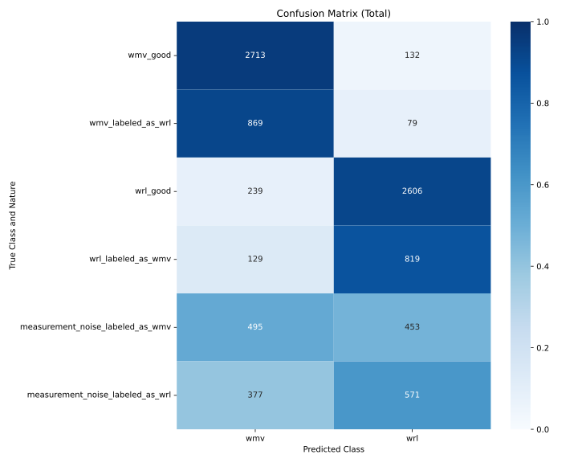
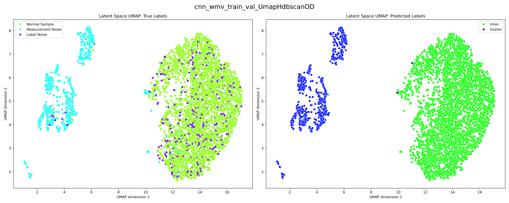
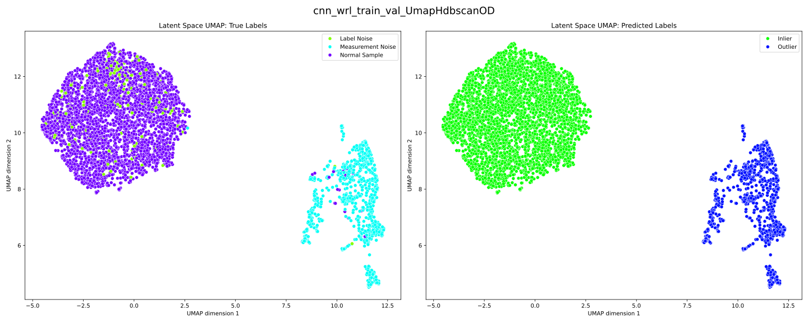
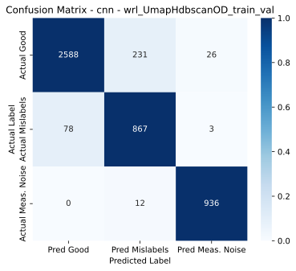

## 🔍 Results
The following results illustrate the outputs produced by CHIMERA when applied to the FashionMNIST and Insect datasets. They showcase the different stages of the pipeline, including predicted label generation, outlier detection, and final noise identification.

### Datasets
- [FashionMNIST](#a-fashionmnist)
- [Insect Dataset](#b-insect-dataset)
### A) FashionMNIST
We consider a binary classification setting with classes **T-shirt (l_n=1)** and **Coat (l_n=2)**. The following results illustrate the different stages of the CHIMERA pipeline on this dataset.

#### Predicted Label generation output

<em>Confusion matrix comparing the predicted label (columns) vs. the given label and type of sample (rows), either normal, label noise or measurement noise.</em>

#### Outlier Detection output 

<em>2D UMAP visualization of Ground-truth (left) vs. Outlier detection results (right) for the T-shirt and Coat classes.</em>

#### Overall Noise detections 

  
  

<em>Final classification of samples into clean data, measurement noise, and label noise.</em>

#### Classification Performance for the different cleaning strategies 

| Dataset Cleaning Setting                      | Mean Accuracy | l_n=1 Accuracy | l_n=2 Accuracy |
|----------------------------------------------|--------------|----------------|----------------|
| Original Noisy Dataset                       | 95.01%       | 95.52%         | 94.49%         |
| Feature Extraction + MCD                     | 95.09%       | 93.98%         | 96.21%         |
| Feature Extraction + 2D UMAP + MCD           | 94.92%       | 93.29%         | 96.56%         |
| Feature Extraction + UMAP + HDBSCAN          | 95.87%       | 95.18%         | 96.56%         |
| **CHIMERA**                                  | **97.33%**   | **97.93%**     | **96.73%**     |
| Clean Data Benchmark                         | 98.71%       | 98.97%         | 98.45%         |

### B) Insect Dataset
We consider a binary classification setting with classes **chicory-leaf miner fly (wmv, l_n=1)** and **carrot fly (wrl, l_n=2)**. The following results illustrate the different stages of the CHIMERA pipeline on this dataset.

#### Predicted Label generation output 

<em>Confusion matrix comparing the predicted label (columns) vs. the given label and type of sample (rows), either normal, label noise or measurement noise.</em>

#### Outlier Detection output 

<em>2D UMAP visualization of Ground-truth (left) vs. Outlier detection results (right) for the chicory-leaf miner fly (wmv) and carrot fly (wrl) classes.</em>

#### Overall Noise detections 

  
  

<em>Final classification of samples into clean data, measurement noise, and label noise.</em>

#### Classification Performance for the different cleaning strategies 

| Dataset Cleaning Setting                      | Mean Accuracy | l_n=1 Accuracy | l_n=2 Accuracy |
|----------------------------------------------|--------------|----------------|----------------|
| Original Noisy Dataset                       | 87.93%       | 93.60%         | 82.27%         |
| Feature Extraction + ECOD                    | 87.93%       | 91.63%         | 84.24%         |
| Feature Extraction + 2D UMAP + MCD           | 87.56%       | 91.87%         | 83.25%         |
| Feature Extraction + UMAP + HDBSCAN          | 88.79%       | 92.61%         | 84.98%         |
| **CHIMERA**                                  | **90.52%**   | **94.58%**     | **86.45%**     |
| Clean Data Benchmark                         | 92.36%       | 94.33%         | 90.39%         |